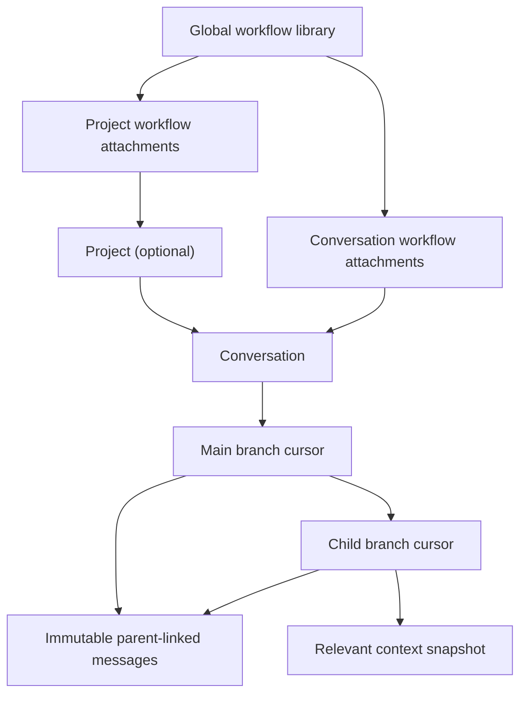
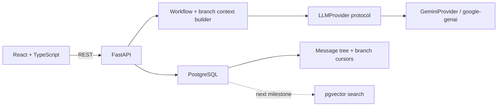

# AI Workspace Manager

AI Workspace Manager is a full-stack workspace for persistent Gemini chats, reusable AI workflows, and tree-shaped conversation branches. A chat may live inside a project or stand alone, while a workflow can be reused across any number of projects and conversations.

## What works now

- Global workflow library with reusable system prompts, prompt templates, and model defaults
- Many-to-many workflow attachment to projects and directly to conversations
- Standalone conversations with no project and, optionally, no workflow
- Sidebar chat navigation with first-tier branch previews and three-dot Rename/Delete menus
- Ordered, deterministic composition of inherited and direct workflows
- Persistent Gemini chat through the official `google-genai` SDK
- Provider abstraction that keeps Gemini-specific code out of conversation logic
- Immutable parent-linked messages and explicit, clickable branch cursors
- Instant one-click branches from assistant answers with no Gemini wait
- Branch and whole-chat titles refreshed once whenever a new branch is created
- Gemini-generated relevance summary when the first branch prompt is sent
- Branch context isolation: raw pre-fork history is replaced by the relevance summary
- Selectable omitted-topic controls that let users restore source context to a branch snapshot
- Gemini reference detection before each later message on a branch
- Persistent prompt offering to start a fresh branch from the main trunk, continue here, or dismiss
- Safe GitHub-flavored Markdown rendering for chat messages, including headings, emphasis, lists, code, links, and tables
- Animated generation feedback with a live elapsed timer and persisted per-reply generation time
- Live, case-insensitive chat search across conversation titles and every stored message in every branch
- One-click guest entry with an isolated 30-day browser workspace for every visitor
- PostgreSQL schema managed through Alembic, with a pgvector-ready Docker image
- Responsive React and TypeScript interface

Semantic/vector ranking remains a later milestone from the original proposal.

## Product model



Projects organize long-running work but do not own workflows or chats. Deleting a project detaches its workflow links and turns its conversations into standalone chats; it does not destroy either resource.

## How branching works

Messages remain one immutable tree:

```text
A → B → C
    └→ D → E
```

A branch is a cursor with a name, fork message, current head, and context snapshot. It does not copy shared messages.

When a user branches from assistant answer `B`:

1. The app immediately creates a branch cursor; it does not wait for Gemini or copy messages.
2. `B` becomes the first visible item on the new branch while earlier history remains stored but hidden.
3. In the background, Gemini names the new branch and recomputes the whole-chat title from all branch names. Ordinary replies never retitle either one.
4. When the user sends the first branch prompt, the source context and that prompt are sent to Gemini.
5. Gemini creates a relevance-only summary, and the branch reply uses that summary plus `B` and the new prompt.
6. Later replies use the summary and messages written on the branch. The original history remains unchanged.

Before a later user message is added to a non-main branch, Gemini checks whether it materially depends on omitted source context. If it does, the draft is not saved yet. The app offers three explicit choices:

- **Start branch** — create a fresh sibling from the main trunk and send the draft there.
- **Continue here** — keep the draft on the current branch despite the warning.
- **Dismiss** — discard the pending suggestion without changing the message tree.

Reference checks are advisory. A temporary detector failure does not lose the draft or block normal generation; the saved user message is marked with `reference_check: unavailable` metadata.

## Architecture



The backend is one FastAPI service. `app/services/llm/provider.py` defines the provider contract; `app/services/llm/gemini.py` is the only Gemini SDK implementation. Automated tests substitute a deterministic fake provider and never spend API quota.

## Local setup

Prerequisites:

- Python 3.11 or newer
- Node.js 20 or newer
- Docker Desktop
- A Gemini API key

Create your local configuration:

```bash
cp .env.example .env
```

Add your key to `.env`:

```dotenv
GEMINI_API_KEY=your-key-here
```

Start PostgreSQL. Host port `5433` is used to avoid a common conflict with a locally installed PostgreSQL server:

```bash
docker compose up -d db
```

Set up and start the API:

```bash
cd backend
python3 -m venv .venv
source .venv/bin/activate
pip install -e ".[dev]"
alembic upgrade head
uvicorn app.main:app --reload
```

In another terminal, start the web app:

```bash
cd frontend
npm install
npm run dev
```

Open [http://localhost:5173](http://localhost:5173). API documentation is available at [http://localhost:8000/docs](http://localhost:8000/docs).

## Environment variables

| Variable | Purpose | Default |
| --- | --- | --- |
| `DATABASE_URL` | SQLAlchemy PostgreSQL connection | Local Docker database on port 5433 |
| `FRONTEND_URL` | Browser origin accepted by CORS | `http://localhost:5173` |
| `VITE_API_URL` | API base URL compiled into the web app | `http://localhost:8000` |
| `ENVIRONMENT` | Environment name | `development` |
| `GEMINI_API_KEY` | Server-side Gemini credential | Required for chat |
| `GEMINI_CHAT_MODEL` | Default Gemini generation model | `gemini-3.6-flash` |
| `GEMINI_REQUEST_TIMEOUT_SECONDS` | Provider request timeout | `60` |
| `GUEST_SESSION_SECRET` | Signs isolated guest-workspace cookies | Local development value; generated by Render |
| `GEMINI_EMBEDDING_MODEL` | Reserved for semantic search | Unset |

Never expose the Gemini key through a variable beginning with `VITE_`. The root `.env` file is ignored by Git.

## Useful API routes

| Route | Purpose |
| --- | --- |
| `GET/POST /api/workflows` | Browse or create global workflows |
| `PUT/DELETE /api/projects/{project_id}/workflows/{workflow_id}` | Attach or detach a project workflow |
| `GET/POST /api/conversations` | Browse or create project/standalone chats; `GET` accepts `q` for title and message-content search |
| `PUT/DELETE /api/conversations/{conversation_id}/workflows/{workflow_id}` | Attach or detach a direct workflow |
| `GET /api/conversations/{conversation_id}/branches` | Load the clickable branch hierarchy |
| `POST /api/conversations/{conversation_id}/branches` | Summarize context and create a branch turn |
| `POST /api/conversations/{conversation_id}/branches/{branch_id}/messages` | Check references and send a turn |
| `POST /api/conversations/{conversation_id}/branch-suggestions/{id}/{action}` | Accept, continue, or dismiss a prompt |

## Verification

Run backend tests:

```bash
cd backend
source .venv/bin/activate
pytest
```

Build the frontend:

```bash
cd frontend
npm run build
```

Verify the PostgreSQL migration and model metadata agree:

```bash
cd backend
source .venv/bin/activate
alembic upgrade head
alembic check
```

The test suite covers guest isolation, workflow composition, standalone chats, deletion preservation, title and message-content search, same-conversation foreign keys, branch ancestry sharing, summary pruning, reference prompts, all three prompt resolutions, nested branches, stale cursors, and provider failure rollback.

## Public prototype deployment

The repository includes a production `Dockerfile` and a Render Blueprint in
`render.yaml`. The container builds the React app, serves it from FastAPI on the
same origin, and applies Alembic migrations before starting.

1. Push the repository to GitHub.
2. In Render, create a new Blueprint and select the repository.
3. Enter `GEMINI_API_KEY` when Render requests the secret value.
4. Deploy the Blueprint and open the generated `onrender.com` address.

The Blueprint uses Render's free web service and free PostgreSQL plans for a
public prototype. Free web services sleep while idle, and free Render databases
expire after 30 days. Upgrade the database before then if its data must persist.

## Current boundaries

- Guest workspaces are isolated with a signed, HTTP-only browser cookie. They are
  intentionally anonymous, so clearing browser data creates a new workspace and
  there is no account-recovery flow.
- Gemini receives hidden source history only after the first branch prompt, when producing the branch summary, and when checking a suspected omitted reference.
- Regular title and full-message-content search is implemented. Semantic embeddings/vector ranking is not implemented yet, though the local database image includes pgvector.
- The included deployment is intentionally public. Visitors do not share chats or
  projects, but they do share the deployment's Gemini request quota.
- Migration `20260903_0002` is intentionally forward-only because the previous schema cannot represent global workflows or standalone conversations without data loss.
